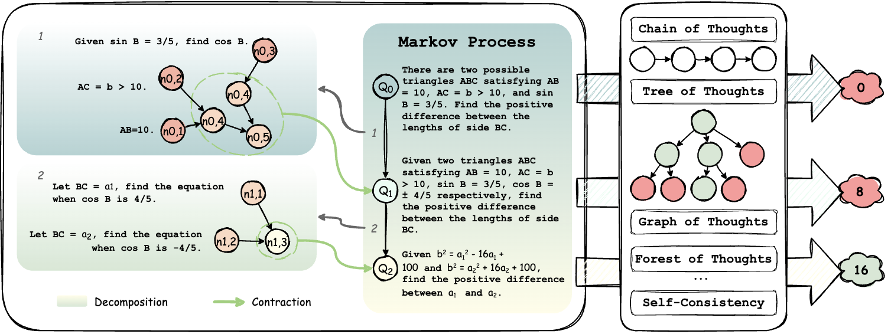

# AoT: Atom of Thoughts for Markov LLM Test-Time Scaling



This is a lightweight, standalone implementation of the paper [Atom of Thoughts for Markov LLM Test-Time Scaling](https://arxiv.org/abs/2502.12018). An implementation under the [MetaGPT](https://github.com/geekan/MetaGPT) (ICLR 2024 Oral) framework is also coming soon, which will be suitable for users familiar with that framework and its excellent open-source projects including but not limited to [AFlow](https://arxiv.org/abs/2410.10762) (ICLR 2025 Oral).

## 📰 News

We're thrilled by the amazing community response to our [post](https://x.com/didiforx/status/1895902471635288252) (380k+ Views) and grateful for all the engaging discussions.

## 📖 Overview

Atom of Thoughts (AoT) is a new reasoning framework that represents the solution as a composition of atomic questions. This approach transforms the reasoning process into a Markov process with atomic states, where state transitions use a two-phase mechanism: first decomposing the current question into a temporary dependency-based directed acyclic graph, then contracting its subquestions to form a new atomic question state. AoT significantly enhances large language models' performance on reasoning tasks while reducing computational waste. Additionally, these atomic states enable AoT to function as a plugin for existing test-time scaling methods, allowing for flexible integration that combines the strengths of different approaches.

**Key Features:**

- **General Reasoning Capability**: Works across diverse reasoning scenarios including math, multi-choice, and multi-hop QA with the same codebase, differentiated only by task-specific prompts
- **Plug-in Enhancement**: Can be integrated with existing test-time scaling methods to improve their performance
- **Resource Efficiency**: Focuses computational resources on effective reasoning rather than processing historical information

## ⚙️ API Configuration Setup

Before using the Atom of Thoughts (AoT) framework, you need to set up your API key and URL:

1. Create an `apikey.py` file in the project root directory with the following format:

```
url = "https://api.openai.com/v1"  # Replace with your API endpoint
api_key = [
    "your-api-key-here",  # Replace with your actual API key
    # You can add multiple API keys to improve concurrency performance.
]
```

## 🚀 Quick Start

### Atom Mode: Using AoT as a reasoning method

Evaluate the performance of AoT on a specific dataset:

```bash
python main.py --dataset math --start 0 --end 10 --model gpt-4o-mini
```

### Command Arguments

- `--dataset`: Choose from `math`, `gsm8k`, `bbh`, `mmlu`, `hotpotqa`, or `longbench`
- `--start` and `--end`: Specify the range of examples to evaluate (e.g., 0-10 for first 10 examples)
- `--model`: Model name of the LLM to use
- `--mode`: Choose between `atom` (main experiment) or `plugin` (generate contracted dataset)

The `plugin` mode enables AoT to serve as a preprocessing step that generates contracted questions which can then be fed into other reasoning frameworks. This approach combines the benefits of AoT's atomic state representation with other test-time scaling methods, allowing the contracted questions to maintain answer equivalence with the original questions while eliminating unnecessary historical information.

## 📝 Citation

```bibtex
@article{teng2024atom,
  title={Atom of Thoughts for Markov LLM Test-Time Scaling},
  author={Teng, Fengwei and Yu, Zhaoyang and Shi, Quan and Zhang, Jiayi and Wu, Chenglin and Luo, Yuyu},
  journal={arXiv preprint arXiv:2502.12018},
  year={2025}
}
```
